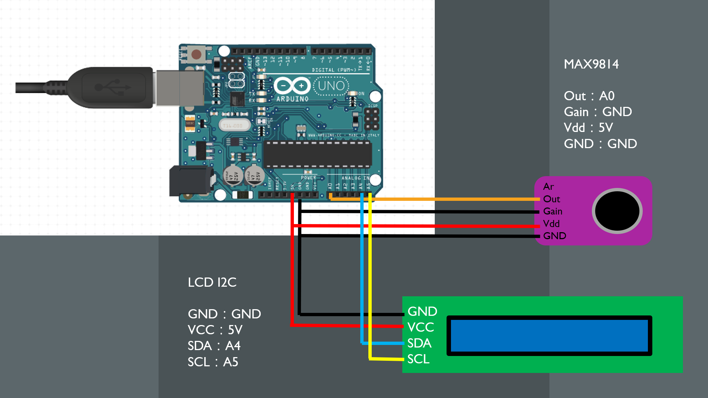

# Arduino Spectrum Analyzer

## Reference
- Arduino Spectrum Analyzer
https://www.youtube.com/watch?v=5RmQJtE61zE
- Sound Spectrum Visualizer with Arduino Nano 33 BLE
https://create.arduino.cc/projecthub/javagoza/sound-spectrum-visualizer-with-arduino-nano-33-ble-3c6261
- 2 x 16-Band Audio Spectrum Analyzer with LCD
https://www.hackster.io/178587/2-x-16-band-audio-spectrum-analyzer-with-lcd-f0a832
- What Is FFT and How Can You Implement It on an Arduino?
https://www.norwegiancreations.com/2017/08/what-is-fft-and-how-can-you-implement-it-on-an-arduino/
